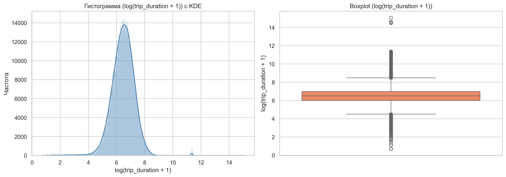
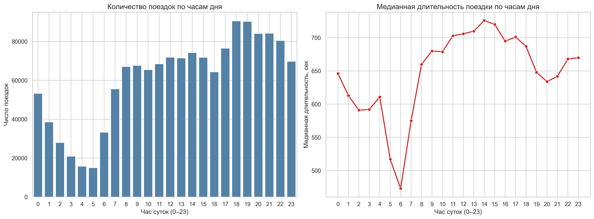
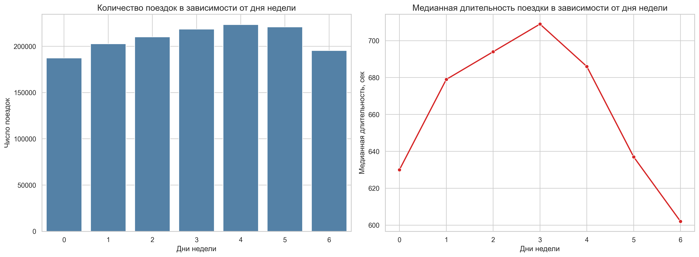
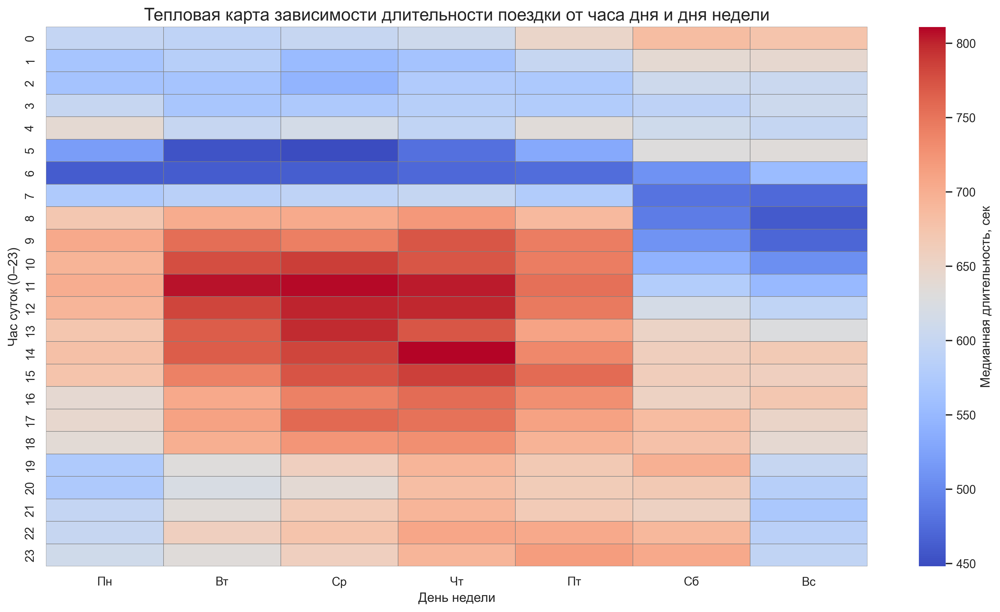
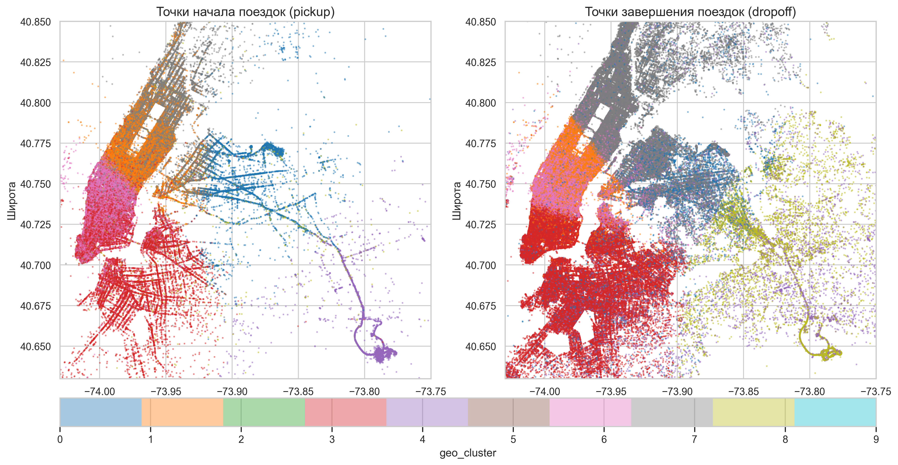

# <center> **NYC Taxi Trip Duration Prediction**

## **Оглавление**
1. [Описание проекта](#Описание-проекта)
2. [Описание данных](#Описание-данных)
3. [Зависимости](#Зависимости)
4. [Установка проекта](#Установка-проекта)
5. [Использование проекта](#Использование-проекта)
6. [Результаты и выводы](#Результаты)
7. [Авторы](#Авторы)


## 1. Описание проекта

**Цель проекта** — построить регрессионную модель для предсказания длительности поездки (`trip_duration`). Построение моделей будет идти по принципу от простого к сложному.

**Задача:** предсказание длительности поездки такси в Нью‑Йорке по признакам поездки (координаты, время, погода, OSRM‑маршрут и др.) с оценкой по метрике RMSLE.

**Основные этапы выполнения проекта:**
* загрузка и предобработка данных
* разведывательный анализ данных 
* создание универсального preprocessor = ColumnTransformer
* Пайплайны:
    * LinearRegression
    * PolynomialFeatures(degree=2), Ridge(alpha=1.0)
    * DecisionTreeRegressor с подбором оптимальной max_depth 
    * RandomForestRegressor - по результатам работы алгоритма ранжируем признаки по важности 
    * GradientBoostingRegressor
    * HistGradientBoostingRegressor
    * VotingRegressor
* подгрузка тестовых данных, их подготовка и построение прогноза на модели с наилучшими результатами
* все результаты работы логируются
* получение submission и участие в соревновании на Kaggle

## Структура проекта

Проект организован по модульному принципу: 
- логика вынесена в `src/`, 
- данные изолированы в `data/`, 
- результаты экспериментов хранятся в `experiments/`.
```
Project-5_Clean/ 
|
├── README.md                           # Документация к проекту (Этот файл)                                                                
├── .gitignore                          # Игнорируемые файлы 
├── requirements.txt                    # Список зависимостей Python 
├── data/                               # Исходные и предобработанные данные 
|   ├── README.md                       # Описание файлов данных и источников
|   ├── .gitkeep                        # Маркер непустой папки для Git  
|   ├── train.csv                       # Обучающая выборка (с таргетом trip_duration) 
|   ├── Project5_test_data.csv          # Тестовая выборка (без таргета) 
|   ├── holiday_data.csv                # Календарь праздников и выходных 
|   ├── weather_data.csv                # Исторические данные о погоде 
|   ├── osrm_data_train.csv             # Маршруты и расстояния (OSRM) для train  
|   └── Project5_osrm_data_test.csv     # Маршруты и расстояния (OSRM) для test  
|     
├── experiments/                        # Результаты экспериментов  
|   ├── plots.png                       # Файлы графиков экспериментов и EDA
|   ├── experiments.json                # Файлы экспериментов .json
|   ├── summary.csv                     # Лог всех запусков (модель, параметры, RMSE)  
|   └── submission.csv                  # Финальный сабмишн для соревнования 
|
├── notebooks/                          # Jupyter Notebook с основным пайплайном 
│   └── trip_duration_prediction.ipynb 
|
└── src/                                # Модули проекта (вынесенная логика) │ 
    ├── init.py                         # Инициализация пакета src │ 
    ├── data_utils.py                   # Функции загрузки, валидации и базовой очистки данных │ 
    ├── features.py                     # Генерация признаков (погода, праздники, OSRM, гео-фичи) │ 
    └── experiment_logger.py            # Логирование результатов в summary.csv 
    └── .pycache/                       # Кэш скомпилированных Python-модулей (игнорируется Git)
```
### Назначение ключевых модулей

- **`src/data_utils.py`**: Отвечает за загрузку CSV-файлов из папки `data/`. 
- **`src/features.py`**: Центральная логика создания признаков. Здесь объединяются данные из `train.csv`, `weather_data.csv`, `holiday_data.csv` и `osrm_*.csv`.
- **`src/experiment_logger.py`**: Автоматически фиксирует параметры модели и метрики (RMSE) в `experiments/summary.csv` после каждого запуска.
- **`notebooks/trip_duration_prediction.ipynb`**: Основной ноутбук, который импортирует функции из `src/` и управляет пайплайном обучения.

2. ## Данные

Используемые датасеты:

1. **Основные данные поездок**: `Project5_train_data.csv`, `Project5_test_data.csv` — базовые признаки поездки:

* **Данные о клиенте и таксопарке:**
    * id - уникальный идентификатор поездки
    * vendor_id - уникальный идентификатор поставщика (таксопарка), связанного с записью поездки

* **Временные характеристики:**
    * pickup_datetime - дата и время, когда был включен счетчик поездки
    * dropoff_datetime - дата и время, когда счетчик был отключен

* **Географическая информация:**
    * pickup_longitude -  долгота, на которой был включен счетчик
    * pickup_latitude - широта, на которой был включен счетчик
    * dropoff_longitude - долгота, на которой счетчик был отключен
    * dropoff_latitude - широта, на которой счетчик был отключен

* **Прочие признаки:**
    * passenger_count - количество пассажиров в транспортном средстве (введенное водителем значение)
    * store_and_fwd_flag - флаг, который указывает, сохранилась ли запись о поездке в памяти транспортного средства перед отправкой поставщику. Y - хранить и пересылать, N - не хранить и не пересылать поездку.

* **Целевой признак:**
    * trip_duration - продолжительность поездки в секундах

2. **OSRM‑маршруты**: `Project5_osrm_data_*.csv` — предосчитанные маршруты (расстояние, время, шаги).
3. **Погодные данные**: `weather_data.csv` — температура, видимость, осадки, ветер по времени.
4. **Календарь и праздники**: `holiday_data.csv` — признак «праздничный день».
5. **Географические кластеры**: предобработанные метки кластеров (`geo_cluster_*`) на основе координат.

### Оценка качества

**Метрика**:  **RMSLE (Root Mean Squared Log Error),** которая вычисляется как:

$$RMSLE = \sqrt{\frac{1}{n}\sum_{i=1}^n(log(y_i+1)-log(\hat{y_i}+1))^2},$$

где:
* $y_i$ - истинная длительность i-ой поездки на такси (trip_duration)
* $\hat{y_i}$- предсказанная моделью длительность i-ой поездки на такси
* Оценка на **валидационной выборке** доступна локально.
* Оценка на **тестовой выборке** — только через сабмит на Kaggle.


## Используемые зависимости
* Python (3.10):
    * pandas=2.0.1
    * numpy=1.24.2
    * scikit-learn=1.2.2
    * scipy=1.15.3
    * matplotlib=3.10.8
    * seaborn=0.13.2


## Установка проекта

```
git clone https://github.com/vavilove001-lab/NYC-Taxi-Trip-Duration-Prediction
```

## Использование

1. Clone the repo:
   ```bash
   git clone https://github.com/vavilove001-lab/NYC-Taxi-Trip-Duration-Prediction
   cd trip-duration-prediction
2. Install dependencies:
    ```bash
    pip install -r requirements.txt
3. Download data files (see data/README.md) and place them in data/
4. Run the notebook:
notebooks/trip_duration_prediction.ipynb


## Результаты и выводы
* Распределение целевой переменной

* Распределение поездок по часам и медианная длительность

* Распределение количества поездок по дням недели и медианная длительность по дням недели

* Тепловая карта зависимости длительности поездки от часа дня и дня недели

* Распределение по кластерам начальных и финальных точек поездок


## Результаты экспериментов

Все запуски в хронологическом порядке. Метрика — **RMSLE** (логарифмический масштаб, `log1p(target)`). Baseline — линейная регрессия (RMSLE 0.5164).

| Model                       | RMSLE (valid) | RMSLE (holdout) | Public LB | Private LB |
|-----------------------------|---------------|-----------------|-----------|------------|
| Linear Regression           | 0.516         | 0.518           | —         | —          |
| Ridge + PolynomialFeatures  | 0.454         | 0.458           | —         | —          |
| Decision Tree               | 0.432         | 0.434           | —         | —          |
| Random Forest               | 0.416         | 0.418           | —         | —          |
| **Gradient Boosting**       | **0.408**     | **0.409**       | —         | —          |
| Hist Gradient Boosting      | 0.405         | 0.406           | —         | —          |
| Voting (Ridge + RF + HGBM)  | 0.412         | 0.414           | —         | —          |
| **Final (GradientBoosting)**| —             | —               | 0.41257   | **0.40902**|

> Все значения RMSLE — в логарифмическом масштабе (`log1p`). Полный лог — `experiments/summary.csv`.


>**Leaderboard**: Public — 0.41257, Private — 0.40902. 

### **Интерпретация результатов**
1. От baseline к бустингу — снижение ошибки на ~21%. Линейная регрессия (RMSLE 0.518) не улавливала нелинейные зависимости. Переход к деревьям и ансамблям последовательно снижал ошибку, и градиентный бустинг стал точкой максимума на тесте (0.4090).

2. HistGradientBoosting vs GradientBoosting. HistGradientBoosting показал лучшую валидацию (0.4046 vs 0.4077), но на тесте классический GradientBoosting оказался стабильнее (0.4090 vs 0.4060). Финальный сабмишн отправлен именно на GradientBoosting, и приватный лидерборд (0.40902) это подтвердил.

3. VotingRegressor — неудачный эксперимент. Усреднение Ridge, RandomForest и HistGBM не дало прироста (RMSLE 0.4142) — ошибки базовых моделей коррелировали, и ансамбль не помог.

4. Переобучение под контролем. Разрыв между Train и Test у финальной модели составляет ~0.023 — умеренный для бустинга. Дальнейший рост сложности (больше итераций, глубже деревья) увеличивал этот разрыв без улучшения теста.

## Способы улучшения метрики
1. подбор гиперпараметров у GradientBoosting 
2. feature engineering и создание новых признаков 
3. Стекинг 

## Авторы
* [Вавилов Павел](https://github.com/vavilove001-lab)